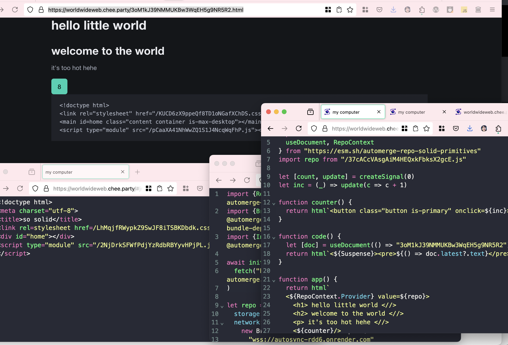

		go to:
			/
		to get a fresh doc
		the path will now be:
			/#$doc-id.html
		this is your editor
		take the # away to see your doc:
			/$doc-id.html
		the extension is just a suggestion (for the editor and content-type)
		so this lets you edit as javascript:
			/#$doc-id.js
		and this lets you edit as css:
			/#$doc-id.css
		and without the hash, that's what they'll be.
		so make some docs:
			/
			/
			/
		and set one .html, one .js, one .css
		you can <script src= your .js doc in the .html

		i call this experiment the **World Wide Web**

# world wide web

